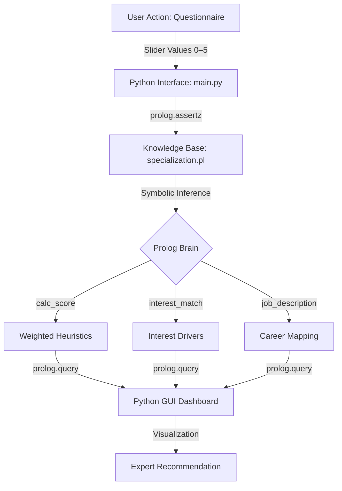

# DCIT 313 — Advanced Rule-Based Expert System

> **Technical Architect & Knowledge Engineer:** SEDEGAH, KIMATHI ELIKPLIM KWASHIE
> 
> **Group Leader & Data Modeler:** FUSEINI, IYAD-DEEN INUSAH
> 
> **Reference Repository:** [sedegah/DCIT-313--Tech-People](https://github.com/sedegah/DCIT-313--Tech-People)

---

## Group Members 
FUSEINI, IYAD-DEEN INUSAH [iyad07] - 22069364

SEDEGAH, KIMATHI E. K. [sedegah] - 22237205

ABDUL SALAM, RABIATU [rabisalam] - 22176448

AWAITEY, CHRIS LARBI [chrislarbi] - 22033787

BOYE, EDMUND NII LARYEA [edmundboye] - 22121983

MENDS-BREW, JASON N. S. [ajmends05] - 22044742

OWUSU-ANSAH, OHENEWAA N. [ohenewaa220] - 22074304


---


> [!WARNING]
> **Local Execution Required:** This project must be run on a local machine with a graphical display environment. Virtual codespaces (GitHub Codespaces, cloud IDEs) do not support GUI rendering and cannot run the CustomTkinter interface.

---

## Table of Contents

1. [Project Overview](#1-project-overview)
2. [Technical Architecture](#2-technical-architecture)
3. [Mathematical Modeling](#3-mathematical-modeling-weighted-heuristics)
4. [Specialization Tracks](#4-specialization-universe-12-tracks)
5. [Group Members & Contributions](#5-group-members--contributions)
6. [Installation & Deployment](#6-installation--deployment)
7. [Validation & Logic Integrity](#7-validation-logic-integrity)

---

## 1. Project Overview

This repository contains a high-fidelity **Knowledge-Based System (KBS)** designed to facilitate academic track selection for Computer Science students. The system implements a decoupled architecture, separating the **Symbolic Logic Engine** (SWI-Prolog) from the **Modern Graphical Interface** (Python).

### Core Mission

To move beyond simple "coding" and build a system that can **reason under uncertainty** — translating human expertise into logical symbols and providing explainable, data-driven academic guidance.

---

## 2. Technical Architecture

The system is built on a strict **Separation of Concerns (SoC)** pattern, creating a clean "Mind-Body" duality between the reasoning engine and the user interface.



### 2.1 Symbolic Intelligence (Prolog)

The reasoning engine resides entirely in `knowledge_base/specialization.pl`.

- **Knowledge Representation:** Production rules paired with a weighted scoring sum model
- **Inference Method:** Data-driven forward-chaining
- **Explainability:** Handled via `why/2`, `job_description/2`, and `interest_match/2` predicates

### 2.2 Inference Actuator (Python / CustomTkinter)

The interface layer residing in `interface/main.py` handles user interaction and system orchestration.

- **UI Engine:** Asynchronous, dark-mode dashboard with real-time feedback
- **Assessment:** 30+ granular questions mapping diverse technical, scientific, and design interests

---

## 3. Mathematical Modeling: Weighted Heuristics

The system calculates a **Certainty Score (CS)** for each specialization track $S$ based on $n$ user traits $T$:

$$Score(S) = \sum_{i=1}^{n} (Trait_i \times Weight_i)$$

This model handles **uncertainty** gracefully. When a student shows moderate interest across multiple areas, the system identifies the statistically dominant track based on expert-defined weightings.

---

## 4. Specialization Universe: 12 Tracks

| Track | Primary Drivers | Career Outcome |
|-------|----------------|----------------|
| **Quantum Computing** | Linear Algebra, Quantum Physics | Quantum Algorithm Researcher |
| **Bioinformatics** | Statistics, Biology, Algorithms | Genomic Data Scientist |
| **NLP & AI** | Linguistics, Probabilistic Models | LLM Engineer / AI Scientist |
| **Computer Vision** | 3D Graphics, Physics, Calculus | Roboticist / CV Researcher |
| **Game Development** | Shader Programming, C++, Physics | Game Engine Architect |
| **Cybersecurity** | OS Internals, Networking, Hacking | Security Forensics Expert |
| **Blockchain** | Cryptography, Distributed Systems | Smart Contract Auditor |
| **AR/VR & HCI** | Spatial UX, Design, Sensors | Immersive System Designer |
| **Big Data** | Parallel Computing, ETL, Statistics | Data Infrastructure Engineer |
| **Cloud / SRE** | Virtualization, Infrastructure, CI/CD | Site Reliability Engineer |
| **IoT Systems** | Embedded C++, Sensors, Networking | Smart Systems Architect |
| **No CS Interest** | None (all scores ≤ 1.0 average) | Alternative Academic Path Recommendation |

---


## 5. Installation & Deployment

### Requirements

- Python 3.10+
- SWI-Prolog (installed and added to system `PATH`)
- Python packages: `customtkinter`, `pyswip`

### Quick Start

```bash
# Install UI and bridge libraries
pip install customtkinter pyswip

# Run the expert system
docs/run.bat
```

> [!IMPORTANT]
> **PATH Configuration:** Ensure `libswipl.dll` (Windows) or `libswipl.so` (Linux) is present in your environment `PATH` before running.

### Keyboard Shortcuts

| Key | Action |
|-----|--------|
| `0` – `5` | Instantly set the slider to that value |
| `←` / `→` Arrow Keys | Fine-tune the response slider |
| `Enter` / `Return` | Submit and advance to the next question |

---

## 6. Validation: Logic Integrity

Run the automated test suite to verify the symbolic logic:

```bash
python interface/test.py
```

Validated against **30+ synthetic profiles**, the system correctly handles:

| Test Case | Behaviour |
|-----------|-----------|
| **Positive Correlation** | High math/physics scores yield Computer Vision or Quantum Computing |
| **Conflicting Inputs** | High biology + data interest balances to Bioinformatics |
| **Zero Interest** | All scores ≤ 1.0 triggers "No CS Interest" with alternative path guidance |
| **Max Intensity** | Excellence across 5+ domains identifies a "Chief Technical Product Architect" |

### Conributions
| Name [username] | ID | Technical Contribution |
|------|------|------------------------|
| FUSEINI, IYAD-DEEN INUSAH [iyad07] | 22069364 | Designed the weighted heuristic matrix and domain mapping |
| SEDEGAH, KIMATHI E. K. [sedegah]| 22237205 | Built the Prolog reasoning engine and the Python FFI bridge |
| ABDUL SALAM, RABIATU [rabisalam] | 22176448 | Verified logic integrity through iterative test cases |
| AWAITEY, CHRIS LARBI [chrislarbi] | 22033787 | Defined the system architecture and decoupled SoC pattern |
| BOYE, EDMUND NII LARYEA [edmundboye] | 22121983 | Implemented the `why` and `interest_match` predicates |
| MENDS-BREW, JASON N. S. [ajmends05] |22044742 | Acquired domestic and global track requirements |
| OWUSU-ANSAH, OHENEWAA N. [ohenewaa220] | 22074304 | Produced the Knowledge Engineering and technical reports |

When a student demonstrates no genuine interest in Computer Science (average score ≤ 1.0), the system provides honest guidance toward alternative academic paths such as Business, Arts, or Social Sciences — preventing misguided career decisions.
