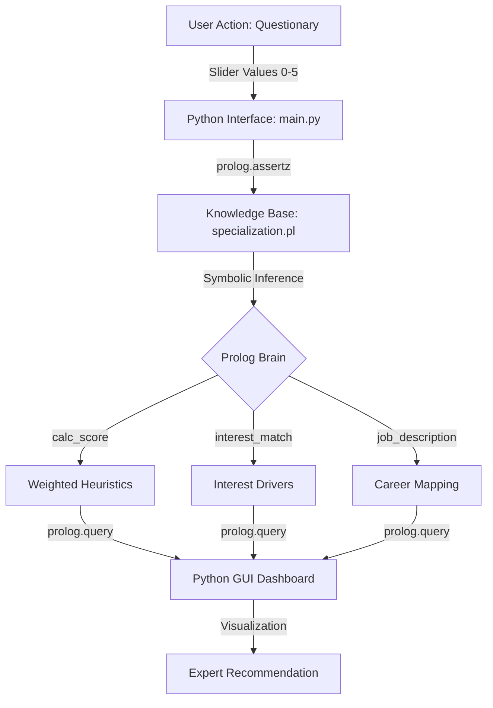

# DCIT 313 Technical Design: Advanced Rule-Based Expert System
**Technical Architect & Knowledge Engineer**: SEDEGAH, KIMATHI ELIKPLIM KWASHIE  
**Group Leader & Data Modeler**: FUSEINI, IYAD-DEEN INUSAH  
**Reference Repository**: [https://github.com/sedegah/DCIT-313--Tech-People](https://github.com/sedegah/DCIT-313--Tech-People)

[!WARNING] Local Execution Required: This project must be run on a local machine with a graphical display environment. Virtual codespaces (GitHub Codespaces, cloud IDEs) do not have GUI visualizers and cannot render the CustomTkinter interface.
---

## 1. Project Overview
This repository contains a high-fidelity **Knowledge-Based System (KBS)** designed to facilitate academic track selection for Computer Science students. The system implements a decoupled architecture, separating the **Symbolic Logic Engine** (SWI-Prolog) from the **Modern Graphical Interface** (Python).

### Core Mission
To move beyond simple "coding" and build a system that can **reason under uncertainty**, translating human expertise into logical symbols and providing explainable academic guidance.

---

## 2. Technical Architecture: The "Mind-Body" Duality

The system is designed using a strict **Separation of Concerns** (SoC) pattern.



### 2.1 Symbolic Intelligence (Prolog)
The "Intelligence" resides entirely in `knowledge_base/specialization.pl`. 
- **Knowledge Representation**: Production rules paired with a weighted scoring sum model.
- **Inference Method**: Data-driven forward-chaining.
- **Explainability**: Handled via `why/2`, `job_description/2`, and `interest_match/2` predicates.

### 2.2 Inference Actuator (Python/CustomTkinter)
The "Body" residing in `interface/main.py` handles user interaction and system orchestration.
- **UI Engine**: Asynchronous, dark-mode dashboard with real-time feedback.
- **Asessment**: 30+ granular questions mapping diverse technical, scientific, and design interests.

---

## 3. Mathematical Modeling: Weighted Heuristics

The system calculates a **Certainty Score (CS)** for each specialization track $S$ based on $n$ user traits $T$.

$$Score(S) = \sum_{i=1}^{n} (Trait_i \times Weight_i)$$

This model ensures the system handles **Uncertainty**. If a student shows moderate interest across many areas, the system identifies the statistically dominant track based on expert-defined weightings.

---

## 4. Specialization Universe: 12 Cutting-Edge Tracks

The system maps interests to the following high-tech domains:

| Track | Primary Drivers | Career Outcome |
|-------|-----------------|----------------|
| **Quantum Computing** | Linear Algebra, Quantum Physics | Quantum Algorithm Researcher |
| **Bioinformatics** | Statistics, Biology, Algorithms | Genomic Data Scientist |
| **NLP & AI** | Linguistics, Probabilistic Models | LLM Engineer / AI Scientist |
| **Computer Vision** | 3D Graphics, Physics, Calculus | Roboticist / CV Researcher |
| **Game Development** | Shader Programming, C++, Physics | Game Engine Architect |
| **Cybersecurity** | OS Internals, Networking, Hacking | Security Forensics Expert |
| **Blockchain** | Cryptography, Distributed Systems | Smart Contract Auditor |
| **AR/VR & HCI** | Spatial UX, Design, Sensors | Immersive System Designer |
| **Big Data** | Parallel Computing, ETL, Statistics | Data Infrastructure Engineer |
| **Cloud/SRE** | Virtualization, Infrastructure, CI/CD | Site Reliability Engineer |
| **IoT Systems** | Embedded C++, Sensors, Networking | Smart Systems Architect |
| **No CS Interest** | None (All scores ≤ 1.0 average) | Alternative Academic Path Recommendation |

---

## 5. Group Members & Technical Contributions

| Name | Role | Technical Contribution |
|------|------|------------------------|
| FUSEINI, IYAD-DEEN INUSAH | **Group Leader & Data Modeler** | Designed the weighted heuristic matrix and domain mapping. |
| SEDEGAH, KIMATHI E. K. | **Software Dev & Knowledge Engineer** | Built the Prolog reasoning engine and the Python FFI bridge. |
| ABDUL SALAM, RABIATU | **Systems Analyst** | Verified the logic integrity through iterative test cases. |
| AWAITEY, CHRIS LARBI | **Technical Architect** | Defined the system architecture and decoupled SoC pattern. |
| BOYE, EDMUND NII LARYEA | **Logic Designer** | Implemented the `why` and `interest_match` predicates. |
| MENDS-BREW, JASON N. S. | **Research Lead** | Acquired domestic and global track requirements. |
| OWUSU-ANSAH, OHENEWAA N. | **Documentation Lead** | Produced the Knowledge Engineering and technical reports. |

---

## 6. Installation and Deployment

### Requirements
- **Python 3.10+**
- **SWI-Prolog** (Installed and added to System PATH)
- **Dependencies**: `customtkinter`, `pyswip`

### Quick Start
```bash
# Install UI and Bridge libraries
pip install customtkinter pyswip

# Run the Expert System
docs/run.bat
```

### Keyboard Shortcuts
For a faster assessment experience, you can use the following keys:
- **Numeric Keys (0-5)**: Instantly set the slider to the corresponding value.
- **Left / Right Arrow Keys**: Fine-tune the response slider.
- **Enter / Return Key**: Submit and move to the next question.

> [!IMPORTANT]
> **PATH Configuration**: Ensure `libswipl.dll` (Windows) or `libswipl.so` (Linux) is in your environment PATH.

---

## 7. Validation: Logic Integrity
To verify the system's symbolic logic, run the automated test suite:
```bash
python interface/test.py
```

Verified against **30+ synthetic profiles**, the system handles:
- **Positive Correlation**: High math/physics yields CV or Quantum.
- **Conflicting Inputs**: Balances high interest in biology and data to yield Bioinformatics.
- **Zero Interest Cases**: All scores ≤ 1.0 average triggers "No CS Interest" recommendation with alternative academic path guidance.
- **Max Intensity Case**: Identifying a "Chief Technical Product Architect" when excellence is demonstrated across more than 5 distinct high-tech domains.

### Ethical AI Feature
The system includes responsible negative case handling - when a student shows no genuine interest in Computer Science (average score ≤ 1.0), it provides honest guidance suggesting alternative academic paths like Business, Arts, or Social Sciences, preventing misguided career decisions.
